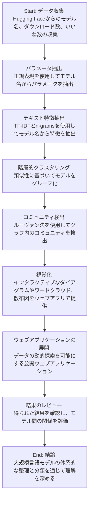

# Title
On the Origin of LLMs: An Evolutionary Tree and Graph for 15,821 Large Language Models

## Links
- https://arxiv.org/abs/2307.09793
- https://arxiv.org/pdf/2307.09793

## AI generated diagram

